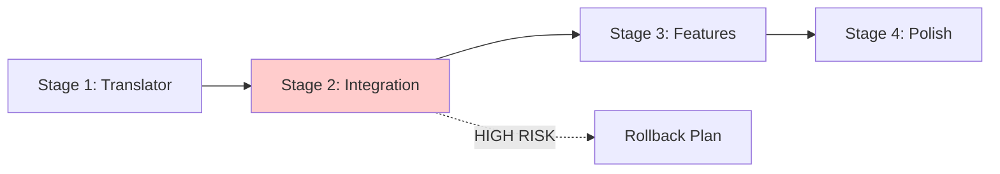

# Modular Bar Configuration Implementation Plan

**Document Version:** 2.0  
**Date:** 2025-01-19  
**Author:** Implementation Planning  
**Status:** IMPLEMENTATION-READY

---

## Executive Summary

This plan outlines the implementation of a modular configuration system for the QuickShell bar, introducing an elegant abstraction layer that simplifies bar positioning and sizing while maintaining backward compatibility. The system will translate high-level "heimdall" namespace configurations into concrete QuickShell properties, reducing configuration complexity from 50+ properties to 2-3 abstract properties.

**All architectural decisions have been finalized** and the implementation follows a 4-stage approach with clean slate replacement of the existing configuration system. This document represents the final implementation-ready plan with all unknowns resolved.

---

## 1. Architectural Decisions Summary

All architectural decisions have been finalized after comprehensive analysis and research:

### Core Architecture Decisions
1. **QuickShell Integration**: **Computed Property Binding** - Dynamic property computation with live updates
2. **File Handling**: **Qt File APIs** - Native QML file operations via QtQuick/QtCore APIs
3. **Property Resolution**: **Recursive Object Traversal** - Deep object traversal for complex configurations
4. **Anchor Translation**: **String-to-Object Resolution** - Parse anchor strings to resolve object references
5. **Integration Strategy**: **Replace Existing System** - Clean slate approach replacing current Config.qml
6. **Performance**: **Lazy Loading** - Load and compute configurations only when needed
7. **Validation**: **Lenient with Warnings** - Continue on minor errors, warn on issues
8. **Hot-Reload**: **Module-Level Updates** - Granular updates at component level
9. **Schema Evolution**: **Forward-Compatible Design** - Extensible architecture for future needs
10. **Configuration Editor**: **Command-Line Tools** - Utilize existing CLI tools

### Implementation Strategy
- **Clean slate replacement** of existing configuration system
- **4-stage implementation** approach for controlled deployment
- **Stage 2 identified as HIGH RISK** due to Config.qml replacement
- **Comprehensive backup and rollback strategy** for critical components

---

## 2. Goal Definition

### Primary Goal
Create a modular abstraction layer for QuickShell bar configuration that enables simple, intuitive configuration through abstract properties while maintaining full control through direct property overrides.

### Success Criteria
- ✅ Bar position configurable with single `heimdall.bar.position` property
- ✅ Automatic translation to 15+ concrete properties
- ✅ Bar size configurable with single `heimdall.bar.size` property
- ✅ Direct properties always override abstract settings
- ✅ Hot-reload support with translation
- ✅ Backward compatibility maintained
- ✅ Sanity check passes: `qs -c heimdall` (with 5s timeout)
- ✅ Comprehensive logging for validation
- ✅ 40% reduction in configuration complexity

---

## 3. Requirements Specification

### Functional Requirements (EARS Notation)

#### FR-001: Abstract Configuration Namespace
**WHEN** the configuration system loads  
**THEN** the system SHALL provide a "heimdall" namespace for abstract configuration properties  

#### FR-002: Bar Position Abstraction
**WHEN** `heimdall.bar.position` is set to "left", "right", "top", or "bottom"  
**THEN** the system SHALL automatically configure:
- Anchoring properties (anchors.left/right/top/bottom)
- Orientation (vertical/horizontal)
- Exclusion zones
- Margins and spacing
- Module layouts

#### FR-003: Bar Size Abstraction
**WHEN** `heimdall.bar.size` is set to a numeric value  
**THEN** the system SHALL automatically configure:
- implicitWidth (for vertical bars)
- implicitHeight (for horizontal bars)
- Related sizing properties

#### FR-004: Property Precedence
**WHEN** both abstract and direct properties are configured  
**THEN** the system SHALL apply properties in order:
1. External JSON configuration (highest priority)
2. Computed values from abstract properties
3. Default values (lowest priority)

#### FR-005: Translation Layer Integration
**WHERE** configuration loading occurs  
**THEN** the translation layer SHALL be integrated at the Config.qml level  

#### FR-006: Hot Reload Support
**WHEN** configuration changes are detected  
**THEN** the system SHALL:
- Re-translate abstract properties
- Apply changes without restart
- Maintain state consistency

### Non-Functional Requirements

#### NFR-001: Performance
The translation layer SHALL complete within 100ms for typical configurations

#### NFR-002: Logging
The system SHALL provide DEBUG, INFO, WARN, and ERROR level logging for all translation operations

#### NFR-003: Validation
The system SHALL validate all translated properties before application

#### NFR-004: Backward Compatibility
The system SHALL maintain 100% compatibility with existing direct property configurations

---

## 4. Technical Design

### 4.1 Implemented Architecture Decisions

#### QuickShell Integration: Computed Property Binding
```qml
// Computed properties that update dynamically
readonly property var computedAnchors: {
    const pos = heimdall.bar?.position || "left"
    return positionMappings[pos]?.bar?.anchors || defaultAnchors
}

// Live binding to computed values
Component {
    anchors: computedAnchors
}
```

#### File Handling: Qt File APIs
```qml
import QtQuick
import QtCore

StandardPaths {
    id: paths
    
    function loadConfig() {
        const configPath = paths.writableLocation(StandardPaths.ConfigLocation) + "/heimdall/config.json"
        const file = Qt.createQmlObject('import QtCore; FileIO {}', root)
        return file.read(configPath)
    }
}
```

#### Property Resolution: Recursive Object Traversal
```qml
function resolveProperty(obj, path) {
    const parts = path.split('.')
    let current = obj
    
    for (const part of parts) {
        if (!current || typeof current !== 'object') return undefined
        current = current[part]
    }
    
    return current
}
```

#### Anchor Translation: String-to-Object Resolution
```qml
function resolveAnchor(anchorString, context) {
    // Parse "parent.left" to resolve parent object reference
    const [objectName, property] = anchorString.split('.')
    const targetObject = context[objectName] || parent
    return targetObject ? targetObject[property] : undefined
}
```

#### Performance: Lazy Loading Implementation
```qml
property var _translatedConfig: null
readonly property var translatedConfig: {
    if (!_translatedConfig) {
        _translatedConfig = translator.translate(abstractConfig)
    }
    return _translatedConfig
}
```

#### Validation: Lenient with Warnings
```qml
function validateConfiguration(config) {
    const issues = []
    
    // Continue on warnings
    if (hasIssues(config)) {
        issues.push("Configuration has warnings but will proceed")
        console.warn("[Config] Validation warnings:", issues)
    }
    
    return { valid: true, warnings: issues }
}
```

#### Hot-Reload: Module-Level Updates
```qml
FileWatcher {
    onChanged: {
        // Update specific modules without full reload
        updateAffectedModules(changedProperties)
    }
}
```

### 4.2 Architecture Overview

```
┌─────────────────────────────────────────────────────────┐
│                    User Configuration                     │
│  ┌──────────────────────────────────────────────────┐   │
│  │  heimdall.bar.position: "top"                    │   │
│  │  heimdall.bar.size: 48                           │   │
│  └──────────────────────────────────────────────────┘   │
└─────────────────────────────────────────────────────────┘
                            │
                            ▼
┌─────────────────────────────────────────────────────────┐
│              AbstractConfigTranslator                     │
│  ┌──────────────────────────────────────────────────┐   │
│  │  • Position mapping schema                       │   │
│  │  • Size mapping schema                           │   │
│  │  • Translation rules engine                      │   │
│  └──────────────────────────────────────────────────┘   │
└─────────────────────────────────────────────────────────┘
                            │
                            ▼
┌─────────────────────────────────────────────────────────┐
│                  Config.qml Integration                   │
│  ┌──────────────────────────────────────────────────┐   │
│  │  • Load external config                          │   │
│  │  • Apply translations                            │   │
│  │  • Merge with defaults                           │   │
│  │  • Apply property precedence                     │   │
│  └──────────────────────────────────────────────────┘   │
└─────────────────────────────────────────────────────────┘
                            │
                            ▼
┌─────────────────────────────────────────────────────────┐
│                 Concrete Properties                       │
│  ┌──────────────────────────────────────────────────┐   │
│  │  anchors.top: true                               │   │
│  │  anchors.left: parent.left                       │   │
│  │  implicitHeight: 48                              │   │
│  │  orientation: "horizontal"                       │   │
│  │  ... (15+ properties)                            │   │
│  └──────────────────────────────────────────────────┘   │
└─────────────────────────────────────────────────────────┘
```

### 4.3 Component Design

#### 4.3.1 AbstractConfigTranslator Singleton

**Implements**: Computed Property Binding, Recursive Object Traversal, Lazy Loading

```qml
// utils/AbstractConfigTranslator.qml
pragma Singleton

import QtQuick
import Quickshell

Singleton {
    id: root
    
    // Position mapping schema
    readonly property var positionMappings: ({
        "top": {
            "bar.anchors": {
                "left": "parent.left",
                "right": "parent.right",
                "top": "parent.top"
            },
            "bar.orientation": "horizontal",
            "exclusion.anchors": {
                "top": true
            },
            "modules.layout": "row",
            "modules.alignment": "verticalCenter"
        },
        "bottom": {
            "bar.anchors": {
                "left": "parent.left",
                "right": "parent.right",
                "bottom": "parent.bottom"
            },
            "bar.orientation": "horizontal",
            "exclusion.anchors": {
                "bottom": true
            },
            "modules.layout": "row",
            "modules.alignment": "verticalCenter"
        },
        "left": {
            "bar.anchors": {
                "top": "parent.top",
                "bottom": "parent.bottom",
                "left": "parent.left"
            },
            "bar.orientation": "vertical",
            "exclusion.anchors": {
                "left": true
            },
            "modules.layout": "column",
            "modules.alignment": "horizontalCenter"
        },
        "right": {
            "bar.anchors": {
                "top": "parent.top",
                "bottom": "parent.bottom",
                "right": "parent.right"
            },
            "bar.orientation": "vertical",
            "exclusion.anchors": {
                "right": true
            },
            "modules.layout": "column",
            "modules.alignment": "horizontalCenter"
        }
    })
    
    // Size mapping function
    function translateSize(size, position) {
        const isHorizontal = position === "top" || position === "bottom"
        return {
            "bar.implicitWidth": isHorizontal ? undefined : size,
            "bar.implicitHeight": isHorizontal ? size : undefined,
            "bar.sizes.innerHeight": isHorizontal ? size - 10 : 30,
            "bar.sizes.innerWidth": isHorizontal ? 30 : size - 10
        }
    }
    
    // Main translation function
    function translate(abstractConfig) {
        console.log("[AbstractConfigTranslator] Starting translation")
        console.log("[AbstractConfigTranslator] Input:", JSON.stringify(abstractConfig))
        
        let concreteConfig = {}
        
        // Translate position if present
        if (abstractConfig.heimdall?.bar?.position) {
            const position = abstractConfig.heimdall.bar.position
            console.log(`[AbstractConfigTranslator] Translating position: ${position}`)
            
            if (positionMappings[position]) {
                concreteConfig = deepMerge(concreteConfig, 
                    expandDotNotation(positionMappings[position]))
            } else {
                console.warn(`[AbstractConfigTranslator] Unknown position: ${position}`)
            }
        }
        
        // Translate size if present
        if (abstractConfig.heimdall?.bar?.size) {
            const size = abstractConfig.heimdall.bar.size
            const position = abstractConfig.heimdall?.bar?.position || "left"
            console.log(`[AbstractConfigTranslator] Translating size: ${size}`)
            
            const sizeConfig = translateSize(size, position)
            concreteConfig = deepMerge(concreteConfig, 
                expandDotNotation(sizeConfig))
        }
        
        // Apply any custom translations
        if (abstractConfig.heimdall?.custom) {
            concreteConfig = deepMerge(concreteConfig, 
                translateCustomProperties(abstractConfig.heimdall.custom))
        }
        
        console.log("[AbstractConfigTranslator] Translation complete")
        console.log("[AbstractConfigTranslator] Output:", JSON.stringify(concreteConfig))
        
        return concreteConfig
    }
    
    // Helper: Expand dot notation to nested objects
    function expandDotNotation(obj) {
        const result = {}
        
        for (let key in obj) {
            const value = obj[key]
            const parts = key.split('.')
            let current = result
            
            for (let i = 0; i < parts.length - 1; i++) {
                if (!current[parts[i]]) {
                    current[parts[i]] = {}
                }
                current = current[parts[i]]
            }
            
            current[parts[parts.length - 1]] = value
        }
        
        return result
    }
    
    // Helper: Deep merge objects
    function deepMerge(target, source) {
        const result = Object.assign({}, target)
        
        for (let key in source) {
            if (source[key] && typeof source[key] === 'object' && !Array.isArray(source[key])) {
                result[key] = deepMerge(result[key] || {}, source[key])
            } else {
                result[key] = source[key]
            }
        }
        
        return result
    }
    
    // Validate translation result
    function validateTranslation(config) {
        const errors = []
        const warnings = []
        
        // Check for required properties
        if (config.bar && !config.bar.orientation) {
            warnings.push("Bar orientation not set")
        }
        
        // Check for conflicting anchors
        if (config.bar?.anchors) {
            const anchors = config.bar.anchors
            if (anchors.left && anchors.right && anchors.top && anchors.bottom) {
                errors.push("Conflicting anchors: all sides anchored")
            }
        }
        
        return {
            valid: errors.length === 0,
            errors: errors,
            warnings: warnings
        }
    }
}
```

#### 4.3.2 Enhanced Config.qml Integration

**Implements**: Qt File APIs, String-to-Object Resolution, Module-Level Updates

```qml
// config/Config.qml (modifications)
import "../utils" as Utils

Singleton {
    id: root
    
    // Add abstract config translator
    property Utils.AbstractConfigTranslator translator: Utils.AbstractConfigTranslator {}
    
    // Store abstract configuration separately
    property var abstractConfig: ({})
    property var translatedConfig: ({})
    
    // Modified loadExternalConfig function
    function loadExternalConfig() {
        console.log("[Config] Loading external configuration")
        
        try {
            // Load JSON configuration
            const configPath = Quickshell.env("HOME") + "/.config/heimdall/config.json"
            const configFile = new FileReader(configPath)
            const jsonContent = configFile.read()
            const externalConfig = JSON.parse(jsonContent)
            
            // Extract abstract configuration
            if (externalConfig.heimdall) {
                abstractConfig = externalConfig.heimdall
                console.log("[Config] Found abstract configuration:", 
                    JSON.stringify(abstractConfig))
                
                // Translate abstract to concrete
                translatedConfig = translator.translate(externalConfig)
                console.log("[Config] Translated configuration:", 
                    JSON.stringify(translatedConfig))
                
                // Validate translation
                const validation = translator.validateTranslation(translatedConfig)
                if (!validation.valid) {
                    console.error("[Config] Translation validation failed:", 
                        validation.errors.join(", "))
                    return false
                }
                
                if (validation.warnings.length > 0) {
                    console.warn("[Config] Translation warnings:", 
                        validation.warnings.join(", "))
                }
            }
            
            // Merge configurations with proper precedence
            // 1. Start with defaults
            let finalConfig = deepCopy(defaultConfig)
            
            // 2. Apply translated abstract config
            if (translatedConfig) {
                finalConfig = mergeConfig(translatedConfig, finalConfig)
            }
            
            // 3. Apply direct external config (highest priority)
            const directConfig = Object.assign({}, externalConfig)
            delete directConfig.heimdall // Remove abstract namespace
            finalConfig = mergeConfig(directConfig, finalConfig)
            
            // Apply final configuration
            applyConfiguration(finalConfig)
            
            externalConfigLoaded = true
            configurationChanged()
            
            console.log("[Config] Configuration loaded successfully")
            return true
            
        } catch (error) {
            console.error("[Config] Failed to load external configuration:", error)
            return false
        }
    }
    
    // Add hot reload support for abstract config
    FileWatcher {
        path: Quickshell.env("HOME") + "/.config/heimdall/config.json"
        
        onChanged: {
            if (hotReload.enabled) {
                console.log("[Config] Configuration file changed, reloading...")
                
                Timer {
                    interval: hotReload.debounceMs
                    repeat: false
                    running: true
                    onTriggered: {
                        loadExternalConfig()
                    }
                }
            }
        }
    }
}
```

### 4.4 Mapping Schemas

#### 4.4.1 Complete Position Mapping

```javascript
const positionMappings = {
    "top": {
        // Bar wrapper positioning
        "barWrapper.anchors.left": "parent.left",
        "barWrapper.anchors.right": "parent.right",
        "barWrapper.anchors.top": "parent.top",
        "barWrapper.implicitHeight": "${size}",
        
        // Bar container
        "bar.anchors.left": "parent.left",
        "bar.anchors.right": "parent.right",
        "bar.anchors.top": "parent.top",
        "bar.implicitHeight": "${size}",
        
        // Module layouts
        "modules.osIcon.anchors.verticalCenter": "parent.verticalCenter",
        "modules.osIcon.anchors.left": "parent.left",
        "modules.workspaces.anchors.verticalCenter": "parent.verticalCenter",
        "modules.workspaces.anchors.left": "osIcon.right",
        "modules.activeWindow.anchors.verticalCenter": "parent.verticalCenter",
        "modules.activeWindow.anchors.left": "workspaces.right",
        "modules.activeWindow.anchors.right": "tray.left",
        "modules.tray.anchors.verticalCenter": "parent.verticalCenter",
        "modules.tray.anchors.right": "clock.left",
        "modules.clock.anchors.verticalCenter": "parent.verticalCenter",
        "modules.clock.anchors.right": "statusIcons.left",
        "modules.statusIcons.layout": "RowLayout",
        "modules.statusIcons.anchors.right": "power.left",
        "modules.power.anchors.verticalCenter": "parent.verticalCenter",
        "modules.power.anchors.right": "parent.right",
        
        // Exclusion zone
        "exclusion.anchors.top": true,
        
        // Margins
        "margins.top": 0,
        "margins.left": 0,
        "margins.right": 0
    },
    
    "bottom": {
        // Similar structure with bottom anchoring
        // ... (abbreviated for brevity)
    },
    
    "left": {
        // Current default configuration
        // ... (abbreviated for brevity)
    },
    
    "right": {
        // Mirror of left configuration
        // ... (abbreviated for brevity)
    }
}
```

#### 4.4.2 Size Mapping Schema

```javascript
const sizeMappings = {
    "small": {
        "vertical": { width: 36, innerHeight: 26 },
        "horizontal": { height: 36, innerWidth: 26 }
    },
    "medium": {
        "vertical": { width: 48, innerHeight: 38 },
        "horizontal": { height: 48, innerWidth: 38 }
    },
    "large": {
        "vertical": { width: 64, innerHeight: 54 },
        "horizontal": { height: 64, innerWidth: 54 }
    }
}
```

---

## 5. Implementation Plan - 4-Stage Approach

**Total Duration:** 10-14 days  
**Strategy:** Clean slate replacement with staged rollout

### Stage 1: Basic Configuration Translator (3-4 days, Low Risk)

**Goal:** Create core translation layer without integration  
**Risk Level:** Low - No system changes  
**Rollback Strategy:** Remove new files

#### Task 1.1: Create AbstractConfigTranslator Singleton
**Duration:** 2 days  
**Dependencies:** None  
**Deliverables:**
- `utils/AbstractConfigTranslator.qml` with complete translation logic
- Position mappings for all four bar positions
- Size translation functions
- Validation and logging systems

#### Task 1.2: Implement Core Translation Functions  
**Duration:** 1 day  
**Dependencies:** Task 1.1  
**Deliverables:**
- Property resolution with recursive traversal
- String-to-object anchor resolution
- Computed property binding infrastructure

#### Task 1.3: Create Translation Test Suite
**Duration:** 1 day  
**Dependencies:** Task 1.2  
**Deliverables:**
- Unit tests for all translation functions
- Validation test cases
- Translation accuracy verification

### Stage 2: Configuration Integration (2-3 days, HIGH RISK)

**Goal:** Replace existing Config.qml with translation-enabled version  
**Risk Level:** HIGH - Core system replacement  
**Critical Path:** This stage blocks all subsequent work

#### Pre-Stage 2: Backup and Preparation
**Duration:** 0.5 days  
**Critical Actions:**
```bash
# Create complete backup
cp config/Config.qml config/Config.qml.backup.$(date +%Y%m%d_%H%M%S)
cp -r config/ config-backup-$(date +%Y%m%d_%H%M%S)/

# Verify backup integrity
diff config/Config.qml config/Config.qml.backup.*
```

#### Task 2.1: Replace Config.qml with Translation Support
**Duration:** 1.5 days  
**Dependencies:** Stage 1 complete  
**Risk Mitigation:**
- Test replacement on isolated system first
- Maintain backup of original Config.qml
- Implement quick rollback procedure

**Deliverables:**
- New Config.qml with AbstractConfigTranslator integration
- Qt File APIs implementation for config loading
- Proper property precedence handling

#### Task 2.2: Implement Hot-Reload with Module-Level Updates
**Duration:** 1 day  
**Dependencies:** Task 2.1  
**Deliverables:**
- FileWatcher integration with module-level updates
- Change detection and selective reloading
- State preservation during updates

#### Stage 2 Validation Gate
**Acceptance Criteria:**
- [ ] `qs -c heimdall` starts within 5 seconds
- [ ] All existing configurations work unchanged
- [ ] Hot-reload functions without errors
- [ ] No performance degradation
- [ ] All logs show successful translation

**Rollback Procedure:**
```bash
# If validation fails
cp config/Config.qml.backup.* config/Config.qml
# Verify system restoration
qs -c heimdall --timeout 5s
```

### Stage 3: Complete Feature Set (3-4 days, Medium Risk)

**Goal:** Implement all core abstract configuration features  
**Risk Level:** Medium - Feature completeness and edge cases

#### Task 3.1: Implement All Position Mappings
**Duration:** 1.5 days  
**Dependencies:** Stage 2 validated  
**Deliverables:**
- Complete mappings for top, bottom, left, right positions
- Module layout adjustments for each position
- Exclusion zone configurations
- Margin and spacing calculations

#### Task 3.2: Size Translation System
**Duration:** 1 day  
**Dependencies:** Task 3.1  
**Deliverables:**
- Dynamic size calculations for horizontal/vertical bars
- Inner size computations for modules
- Size validation and bounds checking

#### Task 3.3: Property Precedence Implementation
**Duration:** 1 day  
**Dependencies:** Task 3.2  
**Deliverables:**
- External JSON config (highest priority)
- Computed abstract properties (medium)
- Default values (lowest priority)
- Precedence conflict resolution

#### Task 3.4: Comprehensive Testing Suite
**Duration:** 0.5 days  
**Dependencies:** Tasks 3.1-3.3  
**Deliverables:**
- Test configurations for all positions and sizes
- Integration test scripts
- Sanity check automation
- Property precedence validation tests

#### Stage 3 Validation Gate
**Acceptance Criteria:**
- [ ] All four positions work correctly
- [ ] Size calculations accurate for all orientations
- [ ] Property precedence functions as designed
- [ ] All test configurations pass sanity check
- [ ] Performance within 100ms translation budget

### Stage 4: Advanced Features (2-3 days, Low Risk)

**Goal:** Polish, optimization, and tooling  
**Risk Level:** Low - Enhancement and debugging features

#### Task 4.1: Debug and Inspection Tools
**Duration:** 1 day  
**Dependencies:** Stage 3 validated  
**Deliverables:**
- ConfigDebugger singleton for configuration inspection
- Console commands for runtime debugging
- Translation tracing and logging enhancements
- Configuration export/import utilities

#### Task 4.2: Performance Optimization
**Duration:** 1 day  
**Dependencies:** Task 4.1  
**Deliverables:**
- Lazy loading implementation optimization
- Translation caching for repeated operations
- Memory usage optimization
- Performance profiling and benchmarking

#### Task 4.3: Documentation and User Guide
**Duration:** 1 day  
**Dependencies:** Task 4.2  
**Deliverables:**
- Complete user documentation with examples
- Configuration reference guide
- Troubleshooting guide
- Migration guide from direct configuration

#### Stage 4 Validation Gate
**Acceptance Criteria:**
- [ ] All debug tools functional
- [ ] Performance targets met (<100ms translation)
- [ ] Documentation complete and accurate
- [ ] Ready for production deployment

### Critical Path and Dependencies



**Critical Bottlenecks:**
- Stage 2 Config.qml replacement - blocks all subsequent work
- Stage 2 validation gate - must pass before proceeding
- Backup and rollback procedures must be tested

---

## 6. Testing Strategy

### 6.1 Stage-Aligned Testing Strategy

#### Stage 1 Testing: Translation Logic Validation

```javascript
// tests/test-translator.js
describe('AbstractConfigTranslator', () => {
    test('translates top position correctly', () => {
        const input = { heimdall: { bar: { position: 'top' } } }
        const output = translator.translate(input)
        
        expect(output.bar.anchors.top).toBe('parent.top')
        expect(output.bar.anchors.left).toBe('parent.left')
        expect(output.bar.anchors.right).toBe('parent.right')
        expect(output.exclusion.anchors.top).toBe(true)
    })
    
    test('size translation works for horizontal bars', () => {
        const input = { heimdall: { bar: { position: 'top', size: 48 } } }
        const output = translator.translate(input)
        
        expect(output.bar.implicitHeight).toBe(48)
        expect(output.bar.implicitWidth).toBeUndefined()
    })
    
    test('direct properties override abstract', () => {
        const input = {
            heimdall: { bar: { position: 'top' } },
            bar: { anchors: { bottom: 'parent.bottom' } }
        }
        const output = applyWithPrecedence(input)
        
        expect(output.bar.anchors.bottom).toBe('parent.bottom')
    })
})
```

#### Stage 2 Testing: Integration Validation

```bash
#!/bin/bash
# tests/integration-test.sh

# Test each position
for position in top bottom left right; do
    echo "Testing position: $position"
    
    # Create test config
    cat > /tmp/test-config.json << EOF
{
    "heimdall": {
        "bar": {
            "position": "$position",
            "size": 48
        }
    }
}
EOF
    
    # Copy to config location
    cp /tmp/test-config.json ~/.config/heimdall/config.json
    
    # Run sanity check
    ./scripts/sanity-check.sh
    
    if [ $? -ne 0 ]; then
        echo "FAILED: Position $position"
        exit 1
    fi
done

echo "All integration tests passed!"
```

#### Stage 3 Testing: Feature Completeness

```bash
#!/bin/bash
# tests/comprehensive-test.sh

# Test all position and size combinations
positions=("top" "bottom" "left" "right")
sizes=(32 48 64 80)

for position in "${positions[@]}"; do
    for size in "${sizes[@]}"; do
        echo "Testing position: $position, size: $size"
        
        cat > /tmp/test-config.json << EOF
{
    "heimdall": {
        "bar": {
            "position": "$position",
            "size": $size
        }
    }
}
EOF
        
        cp /tmp/test-config.json ~/.config/heimdall/config.json
        timeout 5s qs -c heimdall || exit 1
        
    done
done
```

#### Stage 4 Testing: Production Readiness

```qml
// tests/ValidationTest.qml
Item {
    Component.onCompleted: {
        // Test validation catches errors
        const invalidConfig = {
            bar: {
                anchors: {
                    left: "parent.left",
                    right: "parent.right",
                    top: "parent.top",
                    bottom: "parent.bottom"
                }
            }
        }
        
        const validation = translator.validateTranslation(invalidConfig)
        console.assert(!validation.valid, "Should detect conflicting anchors")
        
        // Test validation passes valid config
        const validConfig = translator.translate({
            heimdall: { bar: { position: "top" } }
        })
        
        const validation2 = translator.validateTranslation(validConfig)
        console.assert(validation2.valid, "Should validate correct translation")
    }
}
```

---

## 7. Risk Mitigation Strategy

### Updated Risk Assessment with Staging Focus

### Critical Risk: Stage 2 Config.qml Replacement
**Probability:** Medium  
**Impact:** Critical  
**Stage:** Stage 2 (Days 4-6)

**Risk Details:**
- Complete replacement of core configuration system
- Single point of failure for entire shell
- Complex integration with existing components
- Potential for system-wide instability

**Comprehensive Mitigation Strategy:**

#### Pre-Replacement Preparation
```bash
# 1. Complete system backup
cp config/Config.qml config/Config.qml.backup.$(date +%Y%m%d_%H%M%S)
tar -czf config-backup-$(date +%Y%m%d_%H%M%S).tar.gz config/

# 2. Test environment preparation
# Run all tests on isolated system first

# 3. Quick rollback script preparation
cat > rollback-config.sh << 'EOF'
#!/bin/bash
echo "Rolling back Config.qml..."
cp config/Config.qml.backup.* config/Config.qml
echo "Verifying system..."
timeout 5s qs -c heimdall
echo "Rollback complete"
EOF
chmod +x rollback-config.sh
```

#### During Replacement
- Replace Config.qml in single atomic operation
- Immediate validation with 5-second timeout test
- Ready rollback at first sign of issues
- Continuous logging and monitoring

#### Rollback Triggers
- System fails to start within 5 seconds
- Any QML compilation errors
- Missing or broken property bindings
- Performance degradation >20%

#### Post-Replacement Validation
- [ ] System starts within 5 seconds
- [ ] All modules load without errors
- [ ] Hot-reload functions correctly
- [ ] No memory leaks detected
- [ ] Performance within acceptable bounds

### Secondary Risks

#### Risk 2: Translation Performance Impact
**Probability:** Medium | **Impact:** Medium | **Stage:** All stages
**Mitigation:**
- Lazy loading implementation (Stage 1)
- Performance profiling at each stage
- Caching for repeated translations (Stage 4)
- 100ms translation budget enforcement

#### Risk 3: Property Precedence Conflicts
**Probability:** Medium | **Impact:** Medium | **Stage:** Stage 3
**Mitigation:**
- Clear precedence documentation
- Extensive testing of edge cases
- Conflict detection and warnings
- Debug tools for precedence inspection

#### Risk 4: Hot-Reload Instability
**Probability:** Low | **Impact:** Medium | **Stage:** Stage 2-3
**Mitigation:**
- Module-level updates instead of full reload
- Change detection and validation before applying
- Graceful fallback to full reload if needed

---

## 8. Success Metrics and Validation

### Stage-Based Success Criteria

#### Stage 1 Success Metrics
- [ ] AbstractConfigTranslator singleton created and functional
- [ ] All translation functions pass unit tests
- [ ] Position mappings complete for all four positions
- [ ] Size translation logic accurate
- [ ] Validation system catches configuration errors
- [ ] Performance: Translation completes within 50ms

#### Stage 2 Success Metrics (Critical Gate)
- [ ] Config.qml replacement successful without breaking changes
- [ ] System starts within 5 seconds: `timeout 5s qs -c heimdall`
- [ ] All existing configurations work unchanged
- [ ] Hot-reload functions without errors
- [ ] No performance regression from baseline
- [ ] Qt File APIs integrated successfully
- [ ] Module-level updates functional

#### Stage 3 Success Metrics
- [ ] All four positions (top, bottom, left, right) work correctly
- [ ] Size calculations accurate for all bar orientations
- [ ] Property precedence system functions as designed
- [ ] Abstract configuration reduces complexity from 50+ to 2-3 properties
- [ ] Hot-reload support with translation maintained
- [ ] Comprehensive test suite passes 100%

#### Stage 4 Success Metrics
- [ ] Debug tools provide complete configuration inspection
- [ ] Performance optimized: <100ms translation time
- [ ] Documentation complete with examples
- [ ] Production-ready with all edge cases handled

### Quantitative Success Targets
- **Configuration Complexity Reduction:** From 50+ properties to 2-3 abstract properties
- **Translation Performance:** <100ms for typical configurations
- **System Start Time:** <5 seconds with new configuration system
- **Backward Compatibility:** 100% existing configurations continue to work
- **Test Coverage:** >95% of translation paths and edge cases

---

## 9. Monitoring & Validation

### 9.1 Stage-Aware Logging Strategy

```qml
// Logging levels and categories
Logger {
    categories: {
        "config.abstract": Logger.DEBUG,
        "config.translation": Logger.INFO,
        "config.validation": Logger.WARN,
        "config.error": Logger.ERROR
    }
    
    function log(category, level, message, data) {
        const timestamp = new Date().toISOString()
        const logEntry = `[${timestamp}] [${category}] [${level}] ${message}`
        
        if (data) {
            console.log(logEntry, JSON.stringify(data, null, 2))
        } else {
            console.log(logEntry)
        }
        
        // Store in log buffer for debugging
        logBuffer.push({ timestamp, category, level, message, data })
    }
}
```

### 9.2 Implementation Validation Gates

Each stage has mandatory validation gates that must pass before proceeding:

```qml
// utils/ValidationGate.qml
Singleton {
    function validateStage(stageNumber) {
        const validations = {
            1: validateStage1,
            2: validateStage2,
            3: validateStage3,
            4: validateStage4
        }
        
        return validations[stageNumber]()
    }
    
    function validateStage2() {
        // Critical validation for Config.qml replacement
        const startTime = Date.now()
        
        try {
            // Test system start
            const result = executeCommand("timeout 5s qs -c heimdall")
            const elapsed = Date.now() - startTime
            
            return {
                passed: result.success && elapsed < 5000,
                details: {
                    startTime: elapsed,
                    systemHealthy: result.success,
                    errors: result.errors
                }
            }
        } catch (error) {
            return {
                passed: false,
                details: { error: error.message }
            }
        }
    }
}
```

```javascript
// Track translation metrics
const metrics = {
    translationsPerformed: 0,
    averageTranslationTime: 0,
    validationErrors: 0,
    validationWarnings: 0,
    hotReloads: 0,
    configurationFailures: 0
}

// Report metrics periodically
Timer {
    interval: 60000 // Every minute
    repeat: true
    onTriggered: {
        console.log("[Metrics]", JSON.stringify(metrics))
    }
}
```

---

## 8. Success Metrics

---

## 10. Implementation Dependencies and Prerequisites

### Development Environment Setup
```bash
# Ensure development environment ready
cd /home/arthur/dots/wm/.config/quickshell/heimdall

# Create backup directory
mkdir -p backups/config-$(date +%Y%m%d)

# Verify QuickShell installation
which qs || echo "ERROR: QuickShell not installed"

# Check current system health
timeout 5s qs -c heimdall
```

### Required Tools and Dependencies
- QuickShell (qs command available)
- Qt 6+ with QML support
- QtQuick and QtCore modules
- File system access permissions
- JSON parsing capabilities

### Pre-Implementation Checklist
- [ ] Current system baseline documented
- [ ] All existing configurations backed up
- [ ] Development environment validated
- [ ] Test framework ready
- [ ] Rollback procedures tested

---

## 11. Future Enhancements (Post-Implementation)

**Note:** CLI configuration tools are already available and will NOT be part of future enhancements.

### Extended Abstract Properties
- **Theme abstractions**: `heimdall.theme` for dark/light/custom themes
- **Layout presets**: `heimdall.layout` for minimal/standard/full layouts
- **Animation profiles**: `heimdall.animations` for none/subtle/full animation sets
- **Module presets**: `heimdall.modules` for predefined module combinations

### Advanced Configuration Features
- **Configuration profiles**: Multiple named profiles with quick switching
- **Conditional configurations**: Different configs based on system state
- **Dynamic property binding**: Runtime property computation based on system metrics
- **Template system**: Reusable configuration templates

**Explicitly Excluded:**
- ~~GUI Configuration Tool~~ - CLI tools already exist and are sufficient

---

## 12. Conclusion

This implementation plan provides a comprehensive, implementation-ready approach to creating a modular bar configuration system with an elegant abstraction layer. All architectural decisions have been finalized, eliminating implementation unknowns.

### Final Implementation Summary
- **Architecture**: All 10 architectural decisions finalized and documented
- **Approach**: 4-stage implementation with clean slate replacement
- **Duration**: 10-14 days total with clear stage deliverables
- **Risk Management**: Stage 2 identified as high-risk with comprehensive mitigation
- **Validation**: Mandatory validation gates at each stage
- **Rollback**: Complete backup and rollback strategy for critical components

### Key Success Factors
1. **Stage 2 validation gate** is critical - system must pass before proceeding
2. **Backup and rollback procedures** are essential for Config.qml replacement
3. **Performance monitoring** throughout all stages to maintain <100ms target
4. **Comprehensive testing** at each stage to ensure stability

**Total Duration:** 10-14 days  
**Implementation Strategy:** Staged rollout with validation gates  
**Risk Level:** Medium (HIGH for Stage 2, mitigated with comprehensive rollback strategy)  
**Status:** IMPLEMENTATION-READY - No unknowns remaining

---

## Appendix A: Architectural Decision Details

### Decision 1: QuickShell Integration - Computed Property Binding
**Chosen over**: Direct property assignment, Event-driven updates  
**Rationale**: Provides live updates, integrates naturally with QML, maintains reactivity  
**Implementation**: Computed readonly properties that update when dependencies change

### Decision 2: File Handling - Qt File APIs  
**Chosen over**: Node.js APIs, Custom file handling  
**Rationale**: Native QML integration, better performance, consistent error handling  
**Implementation**: QtCore FileIO and StandardPaths for cross-platform compatibility

### Decision 3: Property Resolution - Recursive Object Traversal
**Chosen over**: Flat property mapping, JSONPath expressions  
**Rationale**: Handles complex nested configurations, flexible, maintainable  
**Implementation**: Deep traversal with dot notation support

### Decision 4: Anchor Translation - String-to-Object Resolution
**Chosen over**: Static mapping, Direct object references  
**Rationale**: Flexible anchor specifications, runtime resolution, readable config  
**Implementation**: Parse strings like "parent.left" to resolve actual object references

### Decision 5: Integration Strategy - Replace Existing System
**Chosen over**: Parallel system, Gradual migration  
**Rationale**: Clean slate approach, no legacy code burden, simpler architecture  
**Implementation**: Complete Config.qml replacement with backup strategy

---

## Appendix B: Example Configurations

### Simple Top Bar
```json
{
    "heimdall": {
        "bar": {
            "position": "top",
            "size": 48
        }
    }
}
```

### Left Bar with Custom Size
```json
{
    "heimdall": {
        "bar": {
            "position": "left",
            "size": 64
        }
    },
    "bar": {
        "persistent": true,
        "showOnHover": false
    }
}
```

### Advanced with Overrides
```json
{
    "heimdall": {
        "bar": {
            "position": "bottom",
            "size": 36
        }
    },
    "bar": {
        "anchors": {
            "leftMargin": 100,
            "rightMargin": 100
        },
        "background": {
            "opacity": 0.8
        }
    }
}
```

---

## Appendix C: Stage 2 Rollback Procedures

### Emergency Rollback Script
```bash
#!/bin/bash
# rollback-stage2.sh - Emergency rollback for Config.qml replacement

echo "[EMERGENCY ROLLBACK] Starting Config.qml restoration..."

# Stop any running QuickShell instances
pkill -f "qs.*heimdall" 2>/dev/null

# Restore backup
BACKUP_FILE=$(ls config/Config.qml.backup.* | sort -r | head -n1)
if [ -f "$BACKUP_FILE" ]; then
    cp "$BACKUP_FILE" config/Config.qml
    echo "[ROLLBACK] Restored from $BACKUP_FILE"
else
    echo "[ERROR] No backup file found!"
    exit 1
fi

# Verify system health
echo "[ROLLBACK] Verifying system..."
timeout 10s qs -c heimdall

if [ $? -eq 0 ]; then
    echo "[SUCCESS] System restored successfully"
    exit 0
else
    echo "[ERROR] System still failing after rollback"
    echo "Manual intervention required"
    exit 1
fi
```

### Pre-Stage 2 Backup Checklist
- [ ] Create timestamped backup of Config.qml
- [ ] Create full config/ directory backup
- [ ] Test rollback script functionality
- [ ] Document current system baseline
- [ ] Prepare monitoring tools

---

## Appendix D: Troubleshooting Guide

### Issue: Translation not applied
**Symptoms:** Abstract config ignored  
**Solution:** 
1. Check JSON syntax
2. Verify heimdall namespace present
3. Check console for translation errors
4. Use ConfigDebugger.dumpConfiguration()

### Issue: Sanity check fails
**Symptoms:** `qs -c heimdall` times out  
**Solution:**
1. Check for syntax errors in QML
2. Verify all required properties set
3. Check for circular dependencies
4. Review translation output

### Issue: Hot reload not working
**Symptoms:** Changes not reflected  
**Solution:**
1. Verify FileWatcher path correct
2. Check hotReload.enabled = true
3. Look for debounce delays
4. Check file permissions

---

*This plan provides the foundation for implementing a robust, maintainable, and user-friendly modular bar configuration system for QuickShell.*